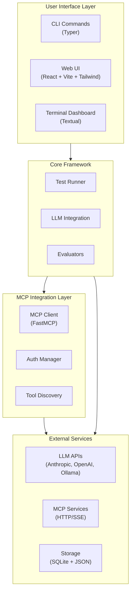

<p align="center">
  
</p>

<p align="center">
  <strong>Test and benchmark LLMs with MCP tools in minutes.</strong>
</p>

<p align="center">
  A testing framework for validating how LLMs call tools via Model Context Protocol (MCP) — compare Claude, GPT-4, Llama, and other models' accuracy, cost, and performance.
</p>

<p align="center">
  <a href="https://www.python.org/downloads/"></a>
  <a href="LICENSE"></a>
  <a href="https://pypi.org/project/testmcpy/"></a>
</p>


---

**[Documentation](context/)** | **[Examples](examples/)** | **[Contributing](CONTRIBUTING.md)** | **[Discussions](https://github.com/preset-io/testmcpy/discussions)**

---

## Why testmcpy?

- **Validate tool calling**: Ensure LLMs call the right tools with correct parameters
- **Compare models**: Find the best price/performance balance for your use case
- **Prevent regressions**: Catch breaking changes in your MCP service with CI/CD
- **Optimize costs**: Track token usage and identify the most cost-effective models

## Quick Start

```bash
# Install testmcpy
pip install testmcpy

# Run interactive setup
testmcpy setup

# Start testing
testmcpy chat                     # Interactive chat with MCP tools
testmcpy research                 # Test LLM tool-calling capabilities
testmcpy run tests/              # Run your test suite
```

That's it! No complex configuration needed to get started.

## Key Features

### Multi-Provider LLM Support

Test with **Claude**, **GPT-4**, **Llama**, and other models. Works with both paid APIs and free local models via Ollama. Includes a Claude SDK provider for subprocess-based MCP support.

| Provider | Models | Features |
|----------|--------|----------|
| Anthropic | claude-opus-4, claude-sonnet-4-5, claude-haiku-4-5 | Native MCP, extended thinking, vision, token caching |
| OpenAI | gpt-4, gpt-4-turbo, gpt-4o | Function calling, vision, cost tracking |
| Ollama | Llama, Mistral, etc. (local) | Free, local execution, no API costs |
| Claude SDK | claude-cli, claude-code | Subprocess-based, full MCP support |


### Built-in Evaluators

Comprehensive validation out of the box. Each evaluator returns a score from 0.0 to 1.0 with pass/fail status and detailed reasoning.

**Tool Calling:**
- `was_mcp_tool_called` — Verify specific tool was invoked (supports prefix/gateway matching)
- `tool_call_count` — Validate number of tool calls
- `tool_called_with_parameter` — Check specific parameter was passed (fuzzy matching)
- `tool_called_with_parameters` — Validate multiple parameters at once
- `parameter_value_in_range` — Ensure numeric parameters are within bounds

**Execution & Performance:**
- `execution_successful` — Check for errors or failures in tool results
- `within_time_limit` — Performance validation against max_seconds
- `final_answer_contains` — Validate response content
- `token_usage_reasonable` — Cost efficiency validation
- `response_time_acceptable` — Latency threshold checking
- `auth_successful` — Authentication flow validation

**Extensible:** Extend `BaseEvaluator` and implement `evaluate(context) -> EvalResult` to create custom evaluators for your domain.


### YAML Test Definitions

Define test suites as code for repeatable, version-controlled testing:

```yaml
version: "1.0"
name: "Chart Operations Test Suite"

config:
  timeout: 30
  model: "claude-sonnet-4-5"
  provider: "anthropic"

tests:
  - name: "test_create_chart"
    prompt: "Create a bar chart showing sales by region"
    evaluators:
      - name: "was_mcp_tool_called"
        args:
          tool_name: "create_chart"
      - name: "execution_successful"

  # Multi-turn test
  - name: "test_multi_turn"
    steps:
      - prompt: "List all dashboards"
        evaluators:
          - name: "was_mcp_tool_called"
            args:
              tool_name: "list_dashboards"
      - prompt: "Show me the first one"
        evaluators:
          - name: "final_answer_contains"
            args:
              content: "dashboard"

  # Load testing
  - name: "test_load"
    prompt: "List dashboards"
    load_test:
      concurrent: 5
      duration: 60
```

### Interactive TUI Dashboard

Beautiful terminal interface for MCP testing — no browser required:

```bash
testmcpy dash                    # Launch interactive dashboard
testmcpy dash --auto-refresh     # Live connection monitoring
testmcpy dash --profile prod     # Use specific MCP profile
```

**TUI Features:**
- Real-time MCP connection status
- Interactive tool exploration
- Live test execution with progress
- Configuration editor
- Global search across tools, tests, and settings
- Help system with keyboard shortcuts (press `?`)
- Multiple themes (default, light, high contrast)

### CLI & Web UI

- **Rich terminal UI**: Progress bars, colored output, formatted tables
- **Optional web interface**: Visual tool explorer, interactive chat, analytics dashboards
- **Real-time feedback**: Watch tests execute with live updates via WebSocket


## Architecture

testmcpy connects your LLM provider to your MCP service and validates the interactions:



**How it works:**
1. Define test cases in YAML with prompts and expected behavior
2. testmcpy sends prompts to your chosen LLM (Claude, GPT-4, Llama, etc.)
3. LLM calls tools via MCP protocol to your service
4. Evaluators validate tool selection, parameters, execution, and performance
5. Get detailed pass/fail results with metrics and cost analysis

## Installation

```bash
# Install base package
pip install testmcpy

# With web UI support
pip install 'testmcpy[server]'

# All optional features
pip install 'testmcpy[all]'
```

**Requirements:** Python 3.10-3.12

## Getting Started

### 1. Configuration

Run the interactive setup wizard:

```bash
testmcpy setup
```

This creates two config files:

**`.llm_providers.yaml`** — LLM configuration:

```yaml
default: prod

profiles:
  prod:
    name: "Production"
    providers:
      - name: "Claude Sonnet"
        provider: "anthropic"
        model: "claude-sonnet-4-5"
        api_key: "your-anthropic-api-key"
        timeout: 60
        default: true
```

**`.mcp_services.yaml`** — MCP server profiles:

```yaml
default: prod

profiles:
  prod:
    name: "Production"
    mcps:
      - name: "My MCP Service"
        mcp_url: "https://your-service.example.com/mcp"
        auth:
          auth_type: "jwt"  # or "bearer", "oauth", "none"
          api_url: "https://auth.example.com/v1/auth/"
          api_token: "your-api-token"
          api_secret: "your-api-secret"
        timeout: 30
        rate_limit_rpm: 60
        default: true
```

**Configuration priority:** CLI options > Profile files > `.env` > User config (`~/.testmcpy`) > Environment variables > Built-in defaults

The setup command is **idempotent** — safe to run multiple times. Use `--force` to overwrite existing files.

### 2. Explore Your MCP Service

```bash
# List available MCP tools
testmcpy tools

# Interactive chat to explore your tools
testmcpy chat

# Run automated research on tool-calling capabilities
testmcpy research --model claude-haiku-4-5
```

### 3. Create and Run Test Suites

```yaml
# tests/my_tests.yaml
version: "1.0"
name: "My MCP Service Tests"

tests:
  - name: "test_tool_selection"
    prompt: "Create a bar chart showing sales by region"
    evaluators:
      - name: "was_mcp_tool_called"
        args:
          tool_name: "create_chart"
      - name: "execution_successful"
      - name: "within_time_limit"
        args:
          max_seconds: 30
```

```bash
testmcpy run tests/ --model claude-haiku-4-5
```

## Commands Reference

| Command | Description |
|---------|-------------|
| **Setup** | |
| `testmcpy setup` | Interactive configuration wizard |
| `testmcpy doctor` | Diagnose installation issues |
| **Discovery** | |
| `testmcpy tools` | List available MCP tools |
| `testmcpy profiles` | List MCP profiles (table) |
| `testmcpy status` | Show MCP connection status |
| `testmcpy explore-cli` | Browse tools (non-interactive) |
| **Testing** | |
| `testmcpy run <path>` | Execute test suite |
| `testmcpy research` | Test LLM tool-calling capabilities |
| `testmcpy chat` | Interactive chat with MCP tools |
| `testmcpy compare` | Multi-model comparison |
| **Advanced** | |
| `testmcpy baseline` | Save and compare against baselines |
| `testmcpy mutate` | Prompt mutation testing |
| `testmcpy metamorphic` | Metamorphic testing |
| **UI** | |
| `testmcpy serve` | Start web UI server (port 8000) |
| `testmcpy dash` | Launch terminal UI dashboard |
| `testmcpy config-cmd` | View current configuration |

**Common options:** `--profile`, `--llm-profile`, `--model`, `--provider`, `--timeout`, `--verbose`, `--output`

## Web Interface

Optional React-based UI with 15+ pages for visual testing and analytics:


```bash
# Install with UI support
pip install 'testmcpy[server]'

# Start server
testmcpy serve
```

| Route | Page | Description |
|-------|------|-------------|
| `/` | MCP Explorer | Tool discovery, smoke tests, schema viewing |
| `/tests` | Test Manager | YAML test browser, execution, results |
| `/reports` | Reports | All test results, evaluations, cost analysis |
| `/chat` | Chat Interface | Multi-turn conversation with MCP tools |
| `/metrics` | Metrics Dashboard | Performance and cost analytics |
| `/compare` | Run Comparison | Side-by-side model comparison |
| `/compatibility` | Compatibility Matrix | Tool/model compatibility view |
| `/mcp-health` | MCP Health | Server health monitoring |
| `/security` | Security Dashboard | Security analysis |
| `/generation-history` | Generation History | AI test generation logs |
| `/auth-debugger` | Auth Debugger | Auth flow debugging |
| `/config` | Configuration | Settings and environment |
| `/mcp-profiles` | MCP Profiles | MCP server configuration |
| `/llm-profiles` | LLM Profiles | LLM provider configuration |

Access at `http://localhost:8000`

## LLM Providers

### Anthropic (Recommended)

Best tool-calling accuracy, native MCP support:

```yaml
# .llm_providers.yaml
prod:
  name: "Production"
  providers:
    - name: "Claude Sonnet"
      provider: "anthropic"
      model: "claude-sonnet-4-5"
      api_key_env: "ANTHROPIC_API_KEY"
      default: true
```

### Ollama (Free, Local)

Perfect for development without API costs:

```bash
brew install ollama  # macOS
ollama serve
ollama pull llama3.1:8b
```

```yaml
local:
  name: "Local Only"
  providers:
    - name: "Ollama Llama"
      provider: "ollama"
      model: "llama3.1:8b"
      base_url: "http://localhost:11434"
      default: true
```

### OpenAI

```yaml
openai:
  name: "OpenAI"
  providers:
    - name: "GPT-4"
      provider: "openai"
      model: "gpt-4-turbo"
      api_key_env: "OPENAI_API_KEY"
      default: true
```

## CI/CD Integration

testmcpy ships as a GitHub Action:

```yaml
- uses: preset-io/testmcpy@v1
  with:
    test-path: tests/
    model: claude-haiku-4-5
    mcp-profile: prod
```

## Custom Evaluators

Extend testmcpy with domain-specific validation:

```python
from testmcpy.evals.base_evaluators import BaseEvaluator, EvalResult

class MyEvaluator(BaseEvaluator):
    def evaluate(self, context: dict) -> EvalResult:
        response = context.get("response", "")
        passed = "expected" in response
        return EvalResult(
            passed=passed,
            score=1.0 if passed else 0.0,
            reason=f"Check passed: {passed}",
        )
```

See **[Evaluator Reference](context/concepts/evaluators.md)** for complete documentation.

## Examples

Check out the `examples/` directory for:

- **Basic test suites** — Simple examples to get started
- **CI/CD integration** — GitHub Actions and GitLab CI workflows
- **Custom evaluators** — Building domain-specific validation
- **Multi-model comparison** — Benchmarking different LLMs

## Contributing

We welcome contributions! Whether it's bug reports, feature requests, documentation improvements, or code contributions.

**[Read the Contributing Guide](CONTRIBUTING.md)** to get started.

## Community & Support

- **Issues**: [Report bugs or request features](https://github.com/preset-io/testmcpy/issues)
- **Discussions**: [Ask questions and share ideas](https://github.com/preset-io/testmcpy/discussions)
- **Documentation**: Browse the [context/](context/) directory
- **Examples**: Explore [examples/](examples/) for sample code

## License

Apache License 2.0 — See [LICENSE](LICENSE) for details.

---

**Built by [@aminghadersohi](https://github.com/aminghadersohi)** at [Preset](https://preset.io).
