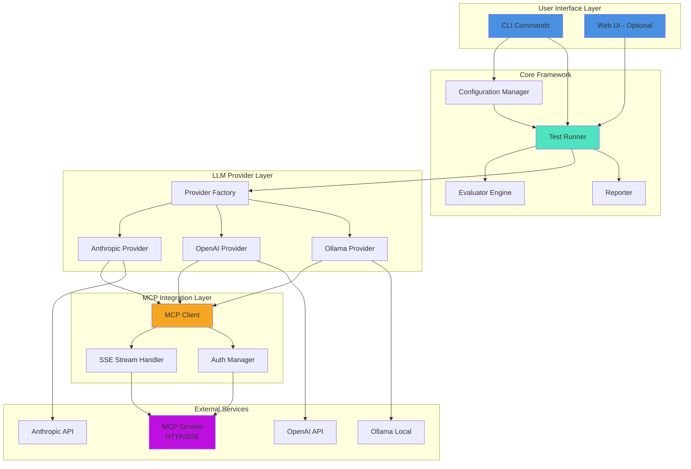
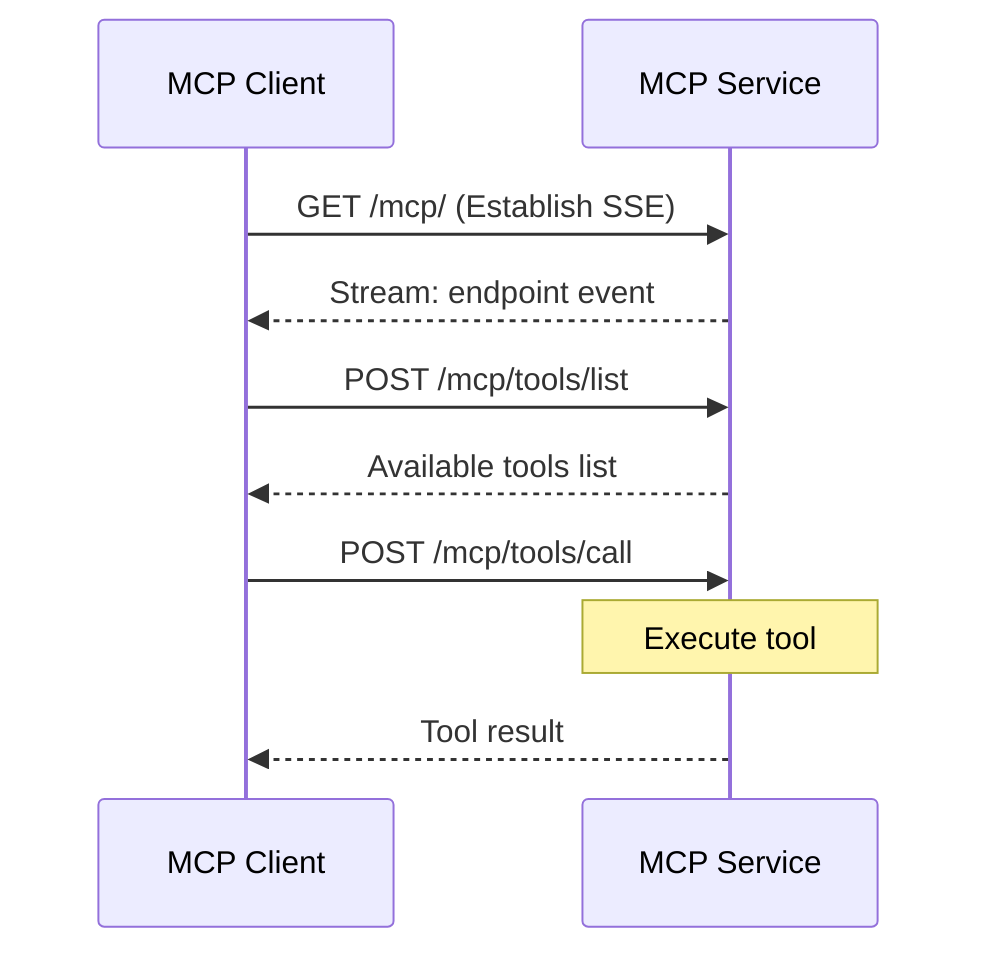
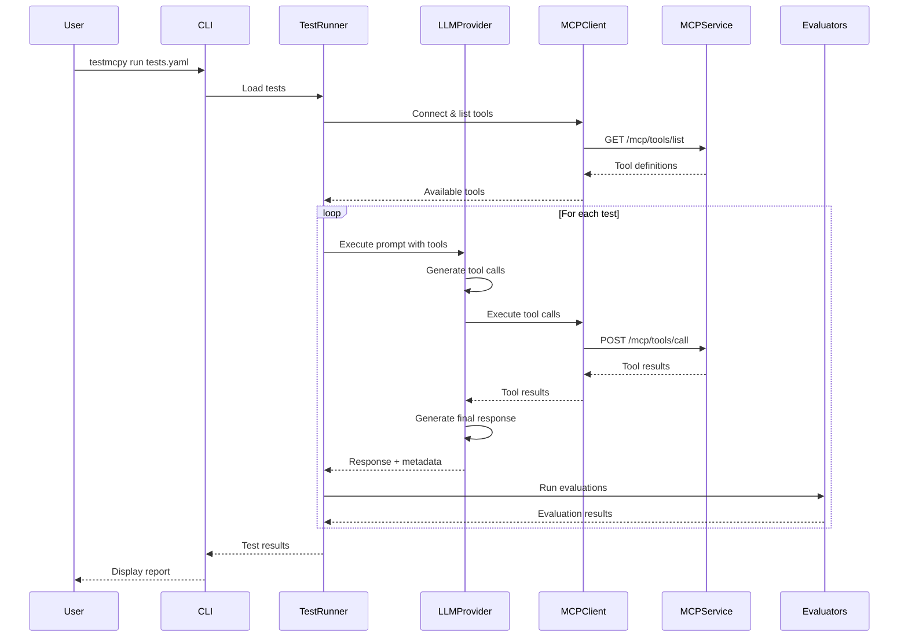
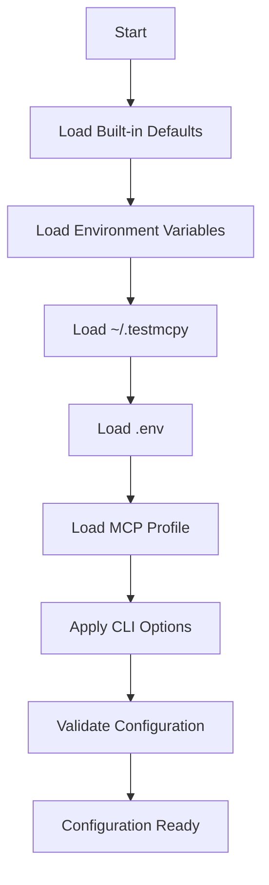

# Architecture Overview

Understanding how testmcpy works under the hood.

## System Architecture



## Core Components

### 1. CLI Interface (`testmcpy/cli.py`)

The command-line interface built with Click framework.

**Key Commands:**
- `setup` - Interactive configuration wizard
- `tools` - List available MCP tools
- `research` - Test tool-calling capabilities
- `run` - Execute test suites
- `chat` - Interactive chat interface
- `serve` - Launch web UI server
- `config-cmd` - View configuration
- `doctor` - Diagnose issues

**Responsibilities:**
- Parse command-line arguments
- Load configuration
- Initialize components
- Display formatted output
- Handle errors and user feedback

### 2. Configuration Manager (`testmcpy/config.py`)

Manages configuration from multiple sources with clear priority.

**Configuration Sources (priority order):**
1. Command-line options
2. MCP profiles (`.mcp_services.yaml`)
3. Environment file (`.env`)
4. User config (`~/.testmcpy`)
5. Environment variables
6. Built-in defaults

**Key Features:**
- Layered configuration merging
- Environment variable substitution
- Profile-based multi-environment support
- Validation and type checking

### 3. MCP Profiles (`testmcpy/mcp_profiles.py`)

Profile-based configuration system for managing multiple environments.

**Features:**
- YAML-based profile definitions
- Multiple authentication types (Bearer, JWT, OAuth)
- Environment variable substitution
- Token caching for JWT
- Automatic profile discovery

**Example:**
```yaml
profiles:
  dev:
    mcp_url: "http://localhost:5008/mcp/"
    auth:
      type: "bearer"
      token: "${DEV_TOKEN}"
  prod:
    mcp_url: "https://api.example.com/mcp/"
    auth:
      type: "jwt"
      api_url: "https://api.example.com/v1/auth/"
```

### 4. Test Runner (`testmcpy/src/test_runner.py`)

Core engine that executes test cases and evaluates results.

**Execution Flow:**
1. Load test definitions (YAML/JSON)
2. Initialize LLM provider
3. Connect to MCP service
4. For each test:
   - Send prompt to LLM
   - LLM makes tool calls via MCP
   - Collect tool results
   - Gather metadata (tokens, cost, time)
   - Run evaluators
   - Generate report
5. Aggregate results

**Key Features:**
- Concurrent test execution
- Timeout handling
- Error recovery
- Progress tracking
- Cost and token tracking

### 5. LLM Integration (`testmcpy/src/llm_integration.py`)

Abstract interface for different LLM providers.

**Provider Architecture:**

```python
class BaseLLMProvider:
    """Base class for LLM providers."""

    async def initialize(self):
        """Initialize provider connection."""
        pass

    async def execute_prompt(self, prompt: str, tools: List[Tool]) -> Response:
        """Execute prompt with tool calling."""
        pass

    async def cleanup(self):
        """Clean up resources."""
        pass
```

**Providers:**

- **AnthropicProvider**: Uses Anthropic's Messages API with MCP tool support
- **OpenAIProvider**: Uses OpenAI's Chat Completions API
- **OllamaProvider**: Connects to local Ollama instance

Each provider:
- Translates MCP tools to provider-specific format
- Handles provider-specific authentication
- Manages streaming responses
- Tracks token usage and costs
- Handles rate limiting

### 6. MCP Client (`testmcpy/src/mcp_client.py`)

Client for communicating with MCP services over HTTP/SSE.

**Responsibilities:**
- Connect to MCP service via HTTP
- Handle Server-Sent Events (SSE) streams
- Manage authentication (Bearer, JWT)
- Discover available tools
- Execute tool calls
- Parse tool results
- Handle errors and retries

**MCP Protocol Flow:**



**Authentication Modes:**

1. **Bearer Token**: Static token in Authorization header
2. **JWT**: Dynamic token fetched from auth API
3. **None**: No authentication (local dev)

### 7. Evaluator Engine (`testmcpy/evals/base_evaluators.py`)

Framework for evaluating test results against expected behavior.

**Evaluator Architecture:**

```python
@dataclass
class EvalResult:
    passed: bool       # Did evaluation pass?
    score: float       # 0.0 to 1.0
    reason: str        # Human-readable explanation
    details: Dict      # Additional data

class BaseEvaluator:
    def evaluate(self, context: Dict[str, Any]) -> EvalResult:
        """Evaluate test context and return result."""
        pass
```

**Context Structure:**

```python
context = {
    "prompt": str,                 # Original prompt
    "response": str,               # LLM's final response
    "tool_calls": List[Dict],      # Tools called
    "tool_results": List[Result],  # Tool execution results
    "metadata": {
        "duration_seconds": float,
        "model": str,
        "total_tokens": int,
        "cost": float
    }
}
```

**Evaluator Categories:**

- **Basic**: Tool selection, execution success
- **Parameter Validation**: Parameter presence and values
- **Content Validation**: Response content checks
- **Performance**: Time and cost limits
- **Domain-Specific**: Custom logic for specific tools

### 8. Reporter (`testmcpy/src/reporter.py`)

Generates formatted reports of test results.

**Output Formats:**
- Terminal (with Rich formatting)
- JSON
- HTML
- Markdown

**Report Contents:**
- Test suite summary
- Individual test results
- Evaluation details
- Performance metrics
- Cost analysis
- Error logs

## Data Flow

### Test Execution Flow



### Configuration Loading Flow



## Design Patterns

### 1. Factory Pattern

Used for LLM providers and evaluators:

```python
def create_provider(provider_name: str) -> BaseLLMProvider:
    providers = {
        "anthropic": AnthropicProvider,
        "openai": OpenAIProvider,
        "ollama": OllamaProvider,
    }
    return providers[provider_name]()

def create_evaluator(name: str, **kwargs) -> BaseEvaluator:
    evaluators = {
        "was_mcp_tool_called": WasMCPToolCalled,
        "execution_successful": ExecutionSuccessful,
        # ...
    }
    return evaluators[name](**kwargs)
```

### 2. Strategy Pattern

Different LLM providers implement same interface:

```python
class BaseLLMProvider:
    async def execute_prompt(self, prompt, tools):
        pass

class AnthropicProvider(BaseLLMProvider):
    async def execute_prompt(self, prompt, tools):
        # Anthropic-specific implementation
        pass

class OpenAIProvider(BaseLLMProvider):
    async def execute_prompt(self, prompt, tools):
        # OpenAI-specific implementation
        pass
```

### 3. Plugin Architecture

Evaluators are extensible plugins:

```python
# Users can create custom evaluators
class CustomEvaluator(BaseEvaluator):
    def evaluate(self, context):
        # Custom logic
        return EvalResult(...)

# Register in factory
evaluators["custom"] = CustomEvaluator
```

## Async Architecture

testmcpy uses async/await for concurrent operations:

```python
async def run_tests(tests: List[Test]) -> List[Result]:
    """Run tests concurrently."""
    tasks = [run_single_test(test) for test in tests]
    return await asyncio.gather(*tasks)

async def run_single_test(test: Test) -> Result:
    """Run a single test."""
    # Execute prompt
    response = await provider.execute_prompt(test.prompt)

    # Run evaluators concurrently
    eval_tasks = [
        evaluator.evaluate(context)
        for evaluator in test.evaluators
    ]
    results = await asyncio.gather(*eval_tasks)

    return Result(results)
```

## Error Handling

### Error Hierarchy

```
Exception
├── TestMCPyError (base)
│   ├── ConfigurationError
│   │   ├── InvalidConfigError
│   │   └── MissingConfigError
│   ├── MCPError
│   │   ├── ConnectionError
│   │   ├── AuthenticationError
│   │   └── ToolExecutionError
│   ├── LLMError
│   │   ├── ProviderError
│   │   ├── RateLimitError
│   │   └── TimeoutError
│   └── EvaluatorError
│       ├── EvaluatorNotFoundError
│       └── EvaluationFailedError
```

### Error Recovery Strategies

1. **Retry with Exponential Backoff**: For rate limits
2. **Timeout Handling**: Cancel long-running operations
3. **Graceful Degradation**: Continue with partial results
4. **Detailed Error Messages**: Help users diagnose issues

## Performance Optimizations

### 1. Concurrent Test Execution

Tests run in parallel when possible:

```python
# Run up to 5 tests concurrently
semaphore = asyncio.Semaphore(5)

async def run_test_with_limit(test):
    async with semaphore:
        return await run_single_test(test)
```

### 2. Connection Pooling

Reuse HTTP connections:

```python
# Single session for all requests
async with aiohttp.ClientSession() as session:
    for test in tests:
        await execute_test(test, session)
```

### 3. Token Caching

Cache JWT tokens to reduce auth API calls:

```python
class JWTAuthManager:
    def __init__(self):
        self.token_cache = {}
        self.cache_duration = 3000  # 50 minutes

    async def get_token(self, api_url):
        if self._is_cached(api_url):
            return self.token_cache[api_url]

        token = await self._fetch_new_token(api_url)
        self.token_cache[api_url] = token
        return token
```

### 4. Streaming Responses

Handle SSE streams efficiently:

```python
async def read_sse_stream(url):
    async with aiohttp.ClientSession() as session:
        async with session.get(url) as response:
            async for line in response.content:
                if line.startswith(b"data: "):
                    yield json.loads(line[6:])
```

## Security Considerations

### 1. Credential Management

- Never log sensitive data
- Use environment variables for secrets
- Support keyring integration
- Clear sensitive data from memory

### 2. Input Validation

- Validate all user inputs
- Sanitize file paths
- Validate URLs
- Type check parameters

### 3. Safe YAML/JSON Loading

```python
import yaml

# Use safe_load to prevent code execution
with open(test_file) as f:
    tests = yaml.safe_load(f)
```

## Extensibility Points

### 1. Custom Evaluators

Users can add domain-specific evaluators:

```python
class MyCustomEvaluator(BaseEvaluator):
    def evaluate(self, context):
        # Custom logic
        return EvalResult(...)
```

### 2. Custom LLM Providers

Support additional LLM providers:

```python
class CustomProvider(BaseLLMProvider):
    async def execute_prompt(self, prompt, tools):
        # Custom provider logic
        pass
```

### 3. Custom Reporters

Add custom output formats:

```python
class CustomReporter(BaseReporter):
    def generate(self, results):
        # Custom report format
        pass
```

## Future Architecture Enhancements

### Planned Improvements

1. **Plugin System**: Dynamic loading of extensions
2. **Distributed Testing**: Run tests across multiple machines
3. **Real-time Dashboard**: Live test execution monitoring
4. **Result Database**: Store and query historical results
5. **ML-based Analysis**: Detect patterns in test failures
6. **Custom MCP Transports**: Support stdio, WebSocket MCP

## Related Documentation

- [Development Guide](development.md) - Contributing to codebase
- [API Reference](../api/cli.md) - Detailed API docs
- [Configuration Guide](configuration.md) - Configuration system
