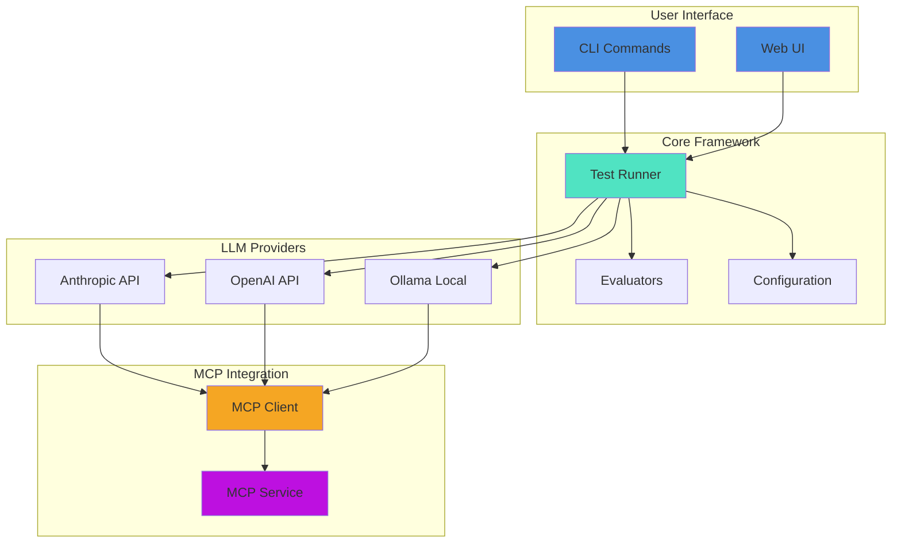

# testmcpy Documentation

> A comprehensive testing framework for validating LLM tool-calling capabilities with MCP (Model Context Protocol) services.

Welcome to the testmcpy documentation! This guide will help you test and evaluate how different LLM models interact with MCP tools.

## Getting Started

New to testmcpy? Start here:

1. **[Quick Start Guide](guide/quickstart.md)** - Get up and running in minutes
2. **[Installation Guide](guide/installation.md)** - Detailed installation instructions
3. **[Basic Test Examples](examples/basic-test.md)** - Simple examples to learn from

## Documentation Structure

### Guides

User guides and tutorials for different use cases:

- **[Quick Start](guide/quickstart.md)** - Installation and first test
- **[Installation](guide/installation.md)** - Detailed installation options
- **[Configuration](guide/configuration.md)** - Configure testmcpy for your environment
- **[Development](guide/development.md)** - Set up development environment
- **[Architecture](guide/architecture.md)** - System architecture overview

### API Reference

Complete reference documentation:

- **[CLI Commands](api/cli.md)** - Command-line interface reference
- **[Evaluators](api/evaluators.md)** - All available evaluators
- **[Test Format](api/test-format.md)** - YAML test file format specification

### Examples

Practical examples and use cases:

- **[Basic Tests](examples/basic-test.md)** - Simple test examples
- **[CI/CD Integration](examples/ci-cd-integration.md)** - GitHub Actions, GitLab CI
- **[Custom Evaluators](examples/custom-evaluators.md)** - Write custom evaluators

## What is testmcpy?

testmcpy is a testing framework that helps you:

- **Test LLM Tool Calling**: Validate how well LLMs interact with your MCP tools
- **Compare Models**: Benchmark Claude, GPT-4, Llama, and other models
- **Ensure Quality**: Catch regressions in tool-calling behavior
- **Optimize Costs**: Find the best price/performance balance
- **Automate Testing**: Run tests in CI/CD pipelines

## Features

- **Multi-Provider Support**: Anthropic (Claude), OpenAI (GPT), Ollama (local models)
- **MCP Tool Testing**: Works with any MCP service
- **Built-in Evaluators**: Test tool selection, parameters, response quality, performance, cost
- **Beautiful CLI**: Rich terminal UI with progress bars
- **Web Interface**: Optional React-based UI
- **Test Suites**: YAML/JSON test definitions
- **Model Comparison**: Side-by-side benchmarking
- **Cost Tracking**: Monitor token usage and API costs

## Quick Example

Create a test file `tests/my_test.yaml`:

```yaml
version: "1.0"
name: "Basic MCP Test"

tests:
  - name: "test_list_datasets"
    prompt: "Show me all available datasets"
    timeout: 15
    evaluators:
      - name: "was_mcp_tool_called"
        args:
          tool_name: "list_datasets"
      - name: "execution_successful"
      - name: "within_time_limit"
        args:
          max_seconds: 10
```

Run the test:

```bash
testmcpy run tests/my_test.yaml
```

## Common Use Cases

### For MCP Service Developers

Test your MCP service to ensure LLMs can use it correctly:

```bash
# Create tests for your tools
testmcpy run tests/

# Run in CI/CD
testmcpy run tests/ --format json --output results.json
```

See: [CI/CD Integration Guide](examples/ci-cd-integration.md)

### For LLM Integration Teams

Compare different models to find the best one for your use case:

```bash
# Test with different models
testmcpy run tests/ --model claude-haiku-4-5 --output haiku.json
testmcpy run tests/ --model claude-sonnet-4-5 --output sonnet.json
testmcpy run tests/ --model gpt-4-turbo --provider openai --output gpt4.json

# Compare results
testmcpy report haiku.json sonnet.json gpt4.json --format html --open
```

### For QA Teams

Validate LLM behavior in different scenarios:

```bash
# Run comprehensive test suite
testmcpy run tests/

# Test specific scenarios
testmcpy run tests/edge_cases.yaml --verbose

# Test against staging
testmcpy run tests/ --profile staging
```

## Architecture Overview



See: [Architecture Guide](guide/architecture.md) for detailed explanation

## Configuration

testmcpy uses a layered configuration system:

**Priority Order** (highest to lowest):
1. Command-line options
2. MCP profiles (`.mcp_services.yaml`)
3. `.env` in current directory
4. `~/.testmcpy` user config
5. Environment variables
6. Built-in defaults

Example `~/.testmcpy`:

```bash
# MCP Service
MCP_URL=http://localhost:5008/mcp/
MCP_AUTH_TOKEN=your_token

# LLM Provider
DEFAULT_PROVIDER=anthropic
DEFAULT_MODEL=claude-haiku-4-5
ANTHROPIC_API_KEY=sk-ant-your-key
```

See: [Configuration Guide](guide/configuration.md)

## Supported LLM Providers

### Anthropic (Claude)

Best tool-calling accuracy, recommended for production:

```bash
DEFAULT_PROVIDER=anthropic
DEFAULT_MODEL=claude-haiku-4-5
ANTHROPIC_API_KEY=sk-ant-your-key
```

**Models**: `claude-haiku-4-5`, `claude-sonnet-4-5`, `claude-opus-4-1`

### OpenAI (GPT)

```bash
DEFAULT_PROVIDER=openai
DEFAULT_MODEL=gpt-4-turbo
OPENAI_API_KEY=sk-your-key
```

**Models**: `gpt-4-turbo`, `gpt-4`, `gpt-3.5-turbo`

### Ollama (Local, Free)

Run models locally without API costs:

```bash
DEFAULT_PROVIDER=ollama
DEFAULT_MODEL=llama3.1:8b
```

**Models**: `llama3.1:8b`, `llama3.1:70b`, `mistral:7b`, and more

## Available Evaluators

testmcpy includes many built-in evaluators:

### Basic Evaluators
- `was_mcp_tool_called` - Verify tool was called
- `execution_successful` - Check for errors
- `final_answer_contains` - Validate response content

### Parameter Validation
- `tool_called_with_parameter` - Check specific parameter
- `tool_called_with_parameters` - Validate multiple parameters
- `parameter_value_in_range` - Numeric range validation
- `tool_call_count` - Verify number of tool calls

### Performance & Cost
- `within_time_limit` - Time constraints
- `token_usage_reasonable` - Cost limits

### Domain-Specific
- `was_superset_chart_created` - Superset/Preset charts
- `sql_query_valid` - SQL validation

**Custom Evaluators**: Easily add your own evaluators for domain-specific validation.

See: [Evaluator Reference](api/evaluators.md)

## CLI Commands

| Command | Description |
|---------|-------------|
| `testmcpy setup` | Interactive configuration wizard |
| `testmcpy tools` | List available MCP tools |
| `testmcpy research` | Test tool-calling capabilities |
| `testmcpy run` | Execute test suite |
| `testmcpy chat` | Interactive chat with MCP tools |
| `testmcpy serve` | Start web UI server |
| `testmcpy report` | Compare test results |
| `testmcpy config-cmd` | View configuration |
| `testmcpy doctor` | Diagnose issues |

See: [CLI Reference](api/cli.md)

## Requirements

- **Python**: 3.9 - 3.12 (3.13+ not yet supported)
- **Virtual Environment**: Recommended
- **Operating Systems**: macOS, Linux, Windows (WSL recommended)

### Optional Dependencies

```bash
pip install 'testmcpy[server]'  # Web UI
pip install 'testmcpy[sdk]'     # Claude Agent SDK
pip install 'testmcpy[dev]'     # Development tools
pip install 'testmcpy[all]'     # Everything
```

## Support & Community

- **GitHub Issues**: [Report bugs](https://github.com/preset-io/testmcpy/issues)
- **GitHub Discussions**: [Ask questions](https://github.com/preset-io/testmcpy/discussions)
- **Documentation**: You're reading it!

## Contributing

We welcome contributions! See [Development Guide](guide/development.md) for:

- Setting up development environment
- Code standards and linting
- Testing guidelines
- Pull request process

## License

Apache License 2.0 - See [LICENSE](../LICENSE) for details.

## Related Projects

- **[Apache Superset](https://superset.apache.org/)** - Data visualization platform
- **[Preset](https://preset.io/)** - Managed Superset platform
- **[MCP (Model Context Protocol)](https://modelcontextprotocol.io/)** - Standard for LLM-tool integration
- **[Anthropic Claude](https://www.anthropic.com/)** - AI assistant with tool calling

## Acknowledgments

Built by the team at [Preset](https://preset.io) for testing LLM integrations with Apache Superset and beyond.

---

**Made with ❤️ by Preset**
